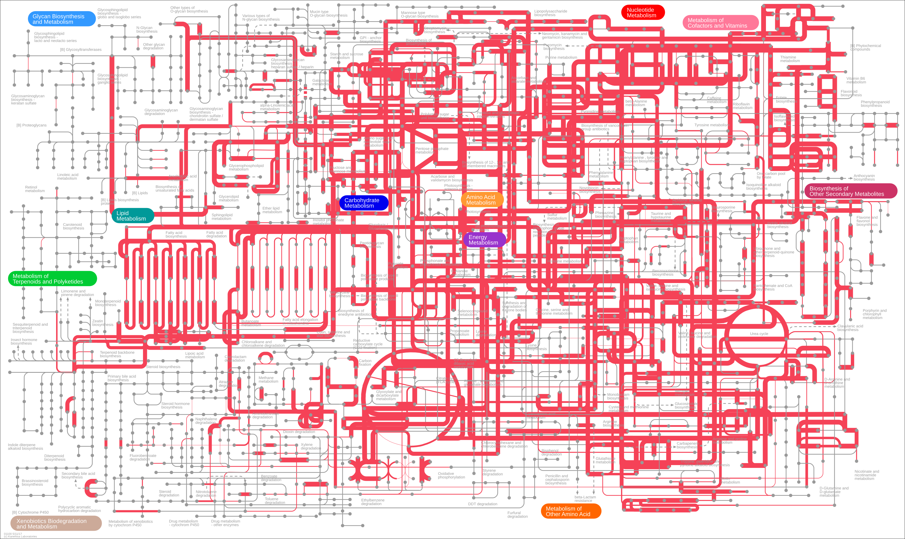
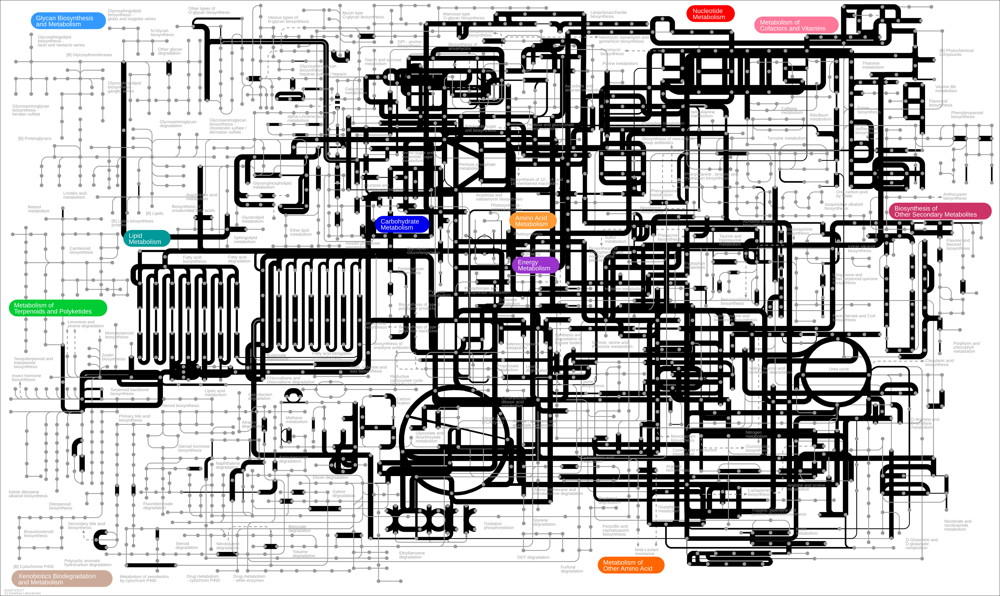
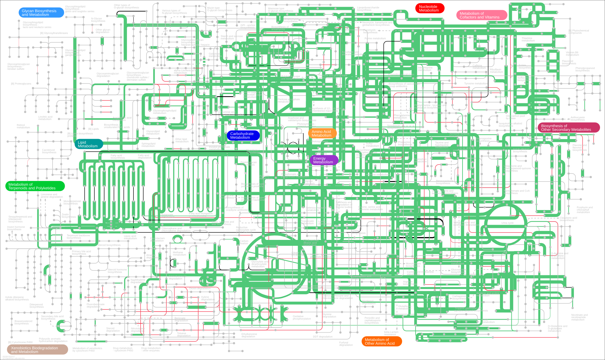

# Functional analyses

```{r load_data05, include=FALSE}
rm(list=ls()) #clear environment
load("data/squirrels_data.Rdata")
```

## Data preparation

```{r GIFTs_data_preparation, echo = T, results = 'hide', warning=FALSE, message=FALSE, cache=FALSE}

tss <- function(abund){sweep(abund, 2, colSums(abund), FUN="/")} 

genome_counts <- genome_counts %>%
  column_to_rownames(var="genome")

#Get list of present MAGs
present_MAGs <- genome_counts %>%
  filter(rowSums(.[, -1]) != 0) %>%
  rownames()

#Align distillr annotations with present MAGs and remove all-zero and all-one traits
present_MAGs <- present_MAGs[present_MAGs %in% rownames(genome_gifts)]
genome_gifts_filt <- genome_gifts[present_MAGs,] %>%
  select_if(~!all(. == 0)) %>%  #remove all-zero modules
  select_if(~!all(. == 1)) #remove all-one modules

GIFTs_elements <- to.elements(genome_gifts_filt,GIFT_db)

#Aggregate element-level GIFTs into the function level
GIFTs_functions <- to.functions(GIFTs_elements,GIFT_db)

#Aggregate function-level GIFTs into overall Biosynthesis, Degradation and Structural GIFTs and get overall metabolic capacity indices per MAG (at the domain level)
GIFTs_domains <- to.domains(GIFTs_functions,GIFT_db) %>% as.data.frame() %>%
  mutate(Overall=rowMeans(select(.,Biosynthesis,Structure,Degradation), na.rm=TRUE))

# #Get overall metabolic capacity indices per MAG (at the domain level)
# rowMeans(GIFTs_functions) # averaged at the function level (each function is weighed equally)
# rowMeans(GIFTs_domains) # averaged at the domain level (each domain is weighed equally)

#Get community-weighed average GIFTs per sample
# GIFTs_elements_community <- to.community(GIFTs_elements,genome_counts,GIFT_db)
# GIFTs_functions_community <- to.community(GIFTs_functions,genome_counts,GIFT_db)
# GIFTs_domains_community <- to.community(GIFTs_domains,genome_counts,GIFT_db)


GIFTs_elements_community <- genome_counts %>%
  tss() %>%
  to.community(GIFTs_elements,.,GIFT_db)

GIFTs_functions_community <- genome_counts %>%
  tss() %>%
  to.community(GIFTs_functions,.,GIFT_db)

GIFTs_domains_community <- genome_counts %>%
  tss() %>%
  to.community(GIFTs_domains,.,GIFT_db)

merge_gift <- GIFTs_domains_community %>% 
  as.data.frame() %>% 
  rownames_to_column(., "sample") %>% 
  merge(., sample_metadata, by="sample")

```


```{r GIFTs_MCI, echo = T, warning=FALSE, message=FALSE}

GIFTs_elements_community %>%
  rowMeans() %>%
  as_tibble(., rownames = "sample") %>%
  left_join(sample_metadata, by = join_by(sample == sample))  %>%
  group_by(species) %>%
  summarise(MCI = mean(value), sd = sd(value))

GIFTs_functions_community %>%
  rowMeans() %>%
  as_tibble(., rownames = "sample") %>%
  left_join(sample_metadata, by = join_by(sample == sample))  %>%
  group_by(species) %>%
  summarise(MCI = mean(value), sd = sd(value))

GIFTs_domains_community %>%
  rowMeans() %>%
  as_tibble(., rownames = "sample") %>%
  left_join(sample_metadata, by = join_by(sample == sample))  %>%
  group_by(species) %>%
  summarise(MCI = mean(value), sd = sd(value))

```


## Genome-specific GIFT profiles

```{r genome_level_GIFTs, warning=FALSE, message=FALSE, fig.width=10, fig.height=20}

mag_elements <- GIFTs_elements %>%
  as_tibble(., rownames = "MAG") %>%
  reshape2::melt() %>%
  rename(Code_element = variable, GIFT = value) %>%
  inner_join(GIFT_db,by="Code_element") %>%
  # arrange(Code_function) %>%    # First sort by val. This sort the dataframe but NOT the factor levels
  # mutate(Functions=factor(Function, levels=Function)) %>%
  ggplot(., aes(x=Code_element, y=MAG, fill=GIFT))+
    geom_tile()+
    scale_y_discrete(guide = guide_axis(check.overlap = TRUE))+
    scale_x_discrete(guide = guide_axis(check.overlap = TRUE))+
    scale_fill_gradientn(limits = c(0,1), colours=brewer.pal(7, "YlGnBu"))+
    #facet_grid(Function ~ ., scales = "free", space = "free")+
    theme_grey(base_size=3)+
    theme(axis.text.x = element_blank(),
          strip.text.y = element_text(angle = 0),
          axis.text.y = element_blank(),
          axis.title.y= element_blank(),
          legend.position="none")

# Generate the phylum color heatmap
phylum_heatmap <- phylum_colors %>%
  right_join(genome_metadata, by=join_by(phylum == phylum)) %>%
  arrange(match(genome, genome_tree$tip.label)) %>%
  select(genome,phylum) %>%
  mutate(phylum = factor(phylum, levels = unique(phylum))) %>%
  column_to_rownames(var = "genome")

#Generate a basal utrametric tree for the sake of visualisation
gift_tree <- force.ultrametric(genome_tree,method="extend") %>%
   ggtree(., expand=1)

#Add phylum colors next to the tree tips
gift_tree <- gheatmap(gift_tree, phylum_heatmap, offset=0, width=0.3, colnames=FALSE, color = NA) +
   scale_fill_manual(values=custom_colors) +
    labs(fill="Phylum") + theme(legend.position="none")

gift_color <- gift_colors %>% pull(Color)
names(gift_color) <- gift_colors$Function

function_heatmap_top <- GIFTs_elements %>%
  as_tibble(., rownames = "MAG") %>%
  reshape2::melt() %>%
  rename(Code_element = variable, GIFT = value) %>%
  inner_join(GIFT_db, by = "Code_element") %>%
  select(Code_element, Function) %>%
  distinct() %>%
  ggplot(aes(x = Code_element)) +  # Use x = Code_element to place tiles along the x-axis
  geom_tile(aes(y = 1, fill = Function, color = Function), width = 0.9, height = 0.08) +  # Adjust width/height
  geom_text(data = . %>% distinct(Function, .keep_all = TRUE),
            aes(y = 1.07, label = Function), vjust = 0.8, hjust = 0, size = 3, angle = 90) +  # Adjust text placement
  scale_fill_manual(values = gift_color) +
  scale_color_manual(values = gift_color) +
  theme_void() +
  theme(
    axis.title.x = element_blank(),
    axis.title.y = element_blank(),
    axis.text.y = element_blank(),
    axis.ticks.y = element_blank(),
    axis.text.x = element_blank(),
    axis.ticks.x = element_blank(),
    strip.text.x = element_blank(),
    legend.position = "none",
    plot.margin = margin(10, 100, 10, 10),
    strip.clip='off'
  ) +
  ylim(0.95, 1.5) +
  coord_cartesian(clip = "off")# Adjust y-limits to control label position
  
mag_elements %>% insert_left(gift_tree, width = .3) %>% insert_top(function_heatmap_top, height=.3)


```

## Domain-level community-averaged GIFT profiles

```{r domain_plots_sp, fig.dim=c(10,8), warning=FALSE, message=FALSE}


#Biosynthesis by species
biosynth.species <- merge_gift %>%
  ggboxplot(., x = "species", y = "Biosynthesis", color = "species", fill="white", add="jitter") +
      scale_color_manual(values=squirrel_colors) +
      scale_fill_manual(values=squirrel_colors) +
      stat_compare_means() +
      theme_classic() +
      labs(y = "Biosynthesis") +
      theme(
        legend.position = "none",
        axis.title.x = element_blank())

#Degradation by species
degradation.species <- merge_gift %>%
  ggboxplot(., x = "species", y = "Degradation", color = "species", fill="white", add="jitter") +
      scale_color_manual(values=squirrel_colors) +
      scale_fill_manual(values=squirrel_colors) +
      stat_compare_means() +
      theme_classic() +
      labs(y = "Degradation") +
      theme(
        legend.position = "none",
        axis.title.x = element_blank())

#Structure by species
structure.species <- merge_gift %>%
  ggboxplot(., x = "species", y = "Structure", color = "species", fill="white", add="jitter") +
      scale_color_manual(values=squirrel_colors) +
      scale_fill_manual(values=squirrel_colors) +
      stat_compare_means() +
      theme_classic() +
      labs(y = "Structure") +
      theme(
        legend.position = "none",
        axis.title.x = element_blank())

#Overall by species
overall.species <- merge_gift %>%
  ggboxplot(., x = "species", y = "Overall", color = "species", fill="white", add="jitter") +
      scale_color_manual(values=squirrel_colors) +
      scale_fill_manual(values=squirrel_colors) +
      stat_compare_means() +
      theme_classic() +
      labs(y = "Overall") +
      theme(
        legend.position = "none",
        axis.title.x = element_blank())


sp.legend <- get_legend(biosynth.species)


ggarrange(biosynth.species, degradation.species, structure.species, overall.species, #+ rremove("x.text"), 
          legend.grob = sp.legend, legend="bottom", common.legend = TRUE,
          #labels = c("A", "B", "C"),
          ncol = 2, nrow = 2)


### Differences in bacterial functional capacity
#grid.arrange(arrangeGrob(p1, p5,p3, p4, ncol = 2))

```

```{r domain_plots_urb, fig.dim=c(10,8), warning=FALSE, message=FALSE}

merge_gift$area_type <-factor(merge_gift$area_type, levels = c("rural", "suburban", "urban"))

#Biosynthesis by species*area_type
biosynth.area <- merge_gift %>%
  ggboxplot(., x = "species", y = "Biosynthesis", color = "area_type", fill="white", add="jitter") +
  scale_color_manual(values=area_colors) +
  scale_fill_manual(values=area_colors) +
  stat_compare_means() +
  theme_classic() +
  labs(y = "Biosynthesis") +
  theme(
    legend.position = "right",
    legend.box = "vertical",
    axis.title.x = element_blank()) +
  guides(color=guide_legend(title="Area type"), fill="none")

#Degradation by species*area_type
degradation.area <- merge_gift %>%
  ggboxplot(., x = "species", y = "Degradation", color = "area_type", fill="white", add="jitter") +
  scale_color_manual(values=area_colors) +
  scale_fill_manual(values=area_colors) +
  stat_compare_means() +
  theme_classic() +
  labs(y = "Degradation") +
  theme(
    legend.position = "right",
    legend.box = "vertical",
    axis.title.x = element_blank()) +
  guides(color=guide_legend(title="Area type"), fill="none")

#Structure by species*area_type
structure.area <- merge_gift %>%
  ggboxplot(., x = "species", y = "Structure", color = "area_type", fill="white", add="jitter") +
  scale_color_manual(values=area_colors) +
  scale_fill_manual(values=area_colors) +
  stat_compare_means() +
  theme_classic() +
  labs(y = "Structure") +
  theme(
    legend.position = "right",
    legend.box = "vertical",
    axis.title.x = element_blank()) +
  guides(color=guide_legend(title="Area type"), fill="none")

#Overall by species*area_type
overall.area <- merge_gift %>%
  ggboxplot(., x = "species", y = "Overall", color = "area_type", fill="white", add="jitter") +
  scale_color_manual(values=area_colors) +
  scale_fill_manual(values=area_colors) +
  stat_compare_means() +
  theme_classic() +
  labs(y = "Overall") +
  theme(
    legend.position = "right",
    legend.box = "vertical",
    axis.title.x = element_blank()) +
  guides(color=guide_legend(title="Area type"), fill="none")

area.legend <- get_legend(biosynth.area)


ggarrange(biosynth.area, degradation.area, structure.area, overall.area, #+ rremove("x.text"),
          legend.grob = area.legend, legend="right", common.legend = TRUE,
          #labels = c("A", "B", "C"),
          ncol = 2, nrow = 2)

```

```{r domain_plots_seas, fig.dim=c(10,8)}

merge_gift$season <-factor(merge_gift$season, levels = c("spring-summer", "autumn", "winter"))

#Biosynthesis by species*season
biosynth.season <- merge_gift %>%
  ggboxplot(., x = "species", y = "Biosynthesis", color = "season", fill="white", add="jitter") +
  scale_color_manual(values=season_colors) +
  scale_fill_manual(values=season_colors) +
  stat_compare_means() +
  theme_classic() +
  labs(y = "Biosynthesis") +
  theme(
    legend.position = "right",
    legend.box = "vertical",
    axis.title.x = element_blank()) +
  guides(color=guide_legend(title="Season"), fill="none")

#Degradation by species*season
degradation.season <- merge_gift %>%
  ggboxplot(., x = "species", y = "Degradation", color = "season", fill="white", add="jitter") +
  scale_color_manual(values=season_colors) +
  scale_fill_manual(values=season_colors) +
  stat_compare_means() +
  theme_classic() +
  labs(y = "Degradation") +
  theme(
    legend.position = "right",
    legend.box = "vertical",
    axis.title.x = element_blank()) +
  guides(color=guide_legend(title="Season"), fill="none")

#Structure by species*season
structure.season <- merge_gift %>%
  ggboxplot(., x = "species", y = "Structure", color = "season", fill="white", add="jitter") +
  scale_color_manual(values=season_colors) +
  scale_fill_manual(values=season_colors) +
  stat_compare_means() +
  theme_classic() +
  labs(y = "Structure") +
  theme(
    legend.position = "right",
    legend.box = "vertical",
    axis.title.x = element_blank()) +
  guides(color=guide_legend(title="Season"), fill="none")

#Overall by species*season
overall.season <- merge_gift %>%
  ggboxplot(., x = "species", y = "Overall", color = "season", fill="white", add="jitter") +
  scale_color_manual(values=season_colors) +
  scale_fill_manual(values=season_colors) +
  stat_compare_means() +
  theme_classic() +
  labs(y = "Overall") +
  theme(
    legend.position = "right",
    legend.box = "vertical",
    axis.title.x = element_blank()) +
  guides(color=guide_legend(title="Season"), fill="none")

season.legend <- get_legend(biosynth.season)


ggarrange(biosynth.season, degradation.season, structure.season, overall.season, #+ rremove("x.text"), 
          legend.grob = season.legend, legend="right", common.legend = TRUE,
          #labels = c("A", "B", "C"),
          ncol = 2, nrow = 2)

```


## Function-level community-averaged GIFT profiles

```{r function_community_GIFTs, warning=FALSE, message=FALSE, fig.width=10, fig.height=8}
# sample_sort <- sample_table %>%
#   select(sample,species,Area_type) %>%
#   arrange(species,Area_type) %>%
#   pull()
   
GIFTs_functions_community %>%
  reshape2::melt() %>%
  rename(sample = Var1, Code_function = Var2, GIFT = value) %>%
  left_join(GIFT_db,by = join_by(Code_function == Code_function)) %>%
  left_join(sample_metadata, by = join_by(sample == sample)) %>%
  #mutate(Function=factor(Function, levels = rev(unique(Function)))) %>%
  ggplot(., aes(y=Function, x=sample, fill=GIFT))+
    geom_tile()+
    scale_y_discrete(guide = guide_axis(check.overlap = TRUE))+
    scale_x_discrete(guide = guide_axis(check.overlap = TRUE))+
    scale_fill_gradientn(colours=brewer.pal(7, "YlGnBu"))+
    facet_grid(~species, scales="free") +
    theme_grey(base_size=8)+
    theme(axis.text.y = element_text(angle = 0, vjust = 0.5, hjust=1), 
          axis.text.x = element_blank(),
          strip.text.x = element_text(angle = 0))


```
```{r functions_species_GIFTs, fig.height=10, fig.width=10, warning=FALSE, message=FALSE }

species.df <- sample_metadata %>%
  select(sample, species, animal)

 GIFTs_functions_community %>%
  as.data.frame() %>%
  rownames_to_column("sample") %>%
  left_join(., species.df, by = join_by(sample == sample)) %>%
  select(-animal) %>%
  pivot_longer(-c(sample, species), names_to = "trait", values_to = "value") %>%
  mutate(trait = case_when(
      trait %in% GIFT_db$Code_function ~ GIFT_db$Function[match(trait, GIFT_db$Code_function)], TRUE ~ trait)) %>%
  mutate(trait=factor(trait,levels=unique(GIFT_db$Function))) %>%
  ggplot(aes(x=value, y=species, group=species, fill=species, color=species)) +
    geom_boxplot() +
    scale_color_manual(name="species",
          breaks=c("Sciurus carolinensis","Sciurus vulgaris"),
          labels=c("Sciurus carolinensis","Sciurus vulgaris"),
          values=c("#999999", "#cc3333")) +
      scale_fill_manual(name="species",
          breaks=c("Sciurus carolinensis","Sciurus vulgaris"),
          labels=c("Sciurus carolinensis","Sciurus vulgaris"),
          values=c("#bfbfbf", "#db7070")) +
    facet_grid(trait ~ ., space="free", scales="free") +
              theme(axis.text.x = element_text(angle = 90, vjust = 0.5, hjust=1),
                    axis.text.y = element_blank(),
                    strip.text.y = element_text(angle = 0)) + 
        labs(y="Traits",x="Metabolic capacity index")
 

```

```{r function_community_factors, echo=T, results='hide', warning=FALSE, message=FALSE}

# functions by host species and urbanization
GIFTs_functions_community %>%
  reshape2::melt() %>%
  rename(sample = Var1, Code_function = Var2, GIFT = value) %>%
  left_join(GIFT_db,by = join_by(Code_function == Code_function)) %>%
  left_join(sample_metadata, by = join_by(sample == sample)) %>%
  #mutate(sample=factor(Sample, levels = sample_sort)) %>%
  ggplot(., aes(y=Function, x=area_type, fill=GIFT))+
    geom_tile()+
    scale_y_discrete(guide = guide_axis(check.overlap = TRUE))+
    scale_x_discrete(guide = guide_axis(check.overlap = TRUE))+
    scale_fill_gradientn(colours=brewer.pal(9, "YlGnBu"))+
    facet_grid(~species, scales="free") +
    theme_grey(base_size=8)+
    theme(axis.text.x = element_text(angle = 0, vjust = 0, hjust=0.5), 
          axis.text.y = element_text(),
          strip.text.x = element_text(angle = 0))


# functions by host species and seasons
sample_metadata$season <-factor(sample_metadata$season, levels = c("spring-summer", "autumn", "winter"))
GIFTs_functions_community %>%
  reshape2::melt() %>%
  rename(sample = Var1, Code_function = Var2, GIFT = value) %>%
  left_join(GIFT_db,by = join_by(Code_function == Code_function)) %>%
  left_join(sample_metadata, by = join_by(sample == sample)) %>%
  #mutate(sample=factor(Sample, levels = sample_sort)) %>%
  ggplot(., aes(y=Function, x=season, fill=GIFT))+
    geom_tile()+
    scale_y_discrete(guide = guide_axis(check.overlap = TRUE))+
    scale_x_discrete(guide = guide_axis(check.overlap = TRUE))+
    scale_fill_gradientn(colours=brewer.pal(9, "YlGnBu"))+
    facet_grid(~species, scales="free") +
    theme_grey(base_size=8)+
    theme(axis.text.x = element_text(angle = 0, vjust = 0, hjust=0.5), 
          axis.text.y = element_text(),
          strip.text.x = element_text(angle = 0))


```


## Element-level community-averaged GIFT profiles 

```{r element_community_GIFT, warning=FALSE, message=FALSE, fig.width=10, fig.height=15}

# GIFTs_elements_community %>%
#   reshape2::melt() %>%
#   rename(sample = Var1, Code_element = Var2, GIFT = value) %>%
#   left_join(sample_metadata, by = join_by(sample == sample)) %>%
#   left_join(GIFT_db,by="Code_element") %>%
#   ggplot(., aes(x=Code_element, y=sample, fill=GIFT))+
#     geom_tile()+
#     scale_y_discrete(guide = guide_axis(check.overlap = TRUE))+
#     scale_x_discrete(guide = guide_axis(check.overlap = TRUE))+
#     scale_fill_gradientn(colours=brewer.pal(9, "YlGnBu"))+
#     theme_grey(base_size=8)+
#     theme(axis.text.x = element_text(angle = 90, vjust = 0.5, hjust=1),
#           strip.text.x = element_text(angle = 90), 
#           axis.text.y = element_blank()) +
#   facet_grid(species ~ Function, scales = "free", space = "free")

GIFTs_elements_community %>%
  reshape2::melt() %>%
  rename(sample = Var1, Code_element = Var2, GIFT = value) %>%
  left_join(sample_metadata, by = join_by(sample == sample)) %>%
  left_join(GIFT_db,by="Code_element") %>%
  ggplot(., aes(y=Element, x=sample, fill=GIFT))+
    geom_tile()+
    scale_y_discrete(guide = guide_axis(check.overlap = TRUE))+
    scale_x_discrete(guide = guide_axis(check.overlap = TRUE))+
    scale_fill_gradientn(colours=brewer.pal(9, "YlGnBu"))+
    theme_grey(base_size=8)+
    theme(,
          strip.text.y = element_text(angle = 0), 
          axis.text.x = element_blank()) +
  facet_grid( Function ~ species , scales = "free", space = "free")


 
```

### Comparisons between host species

#### Significantly enriched elements

```{r diff_table_prep }

elem_gift <- GIFTs_elements_community %>%
  as.data.frame() %>%
  rownames_to_column(var='sample') %>%
  left_join(sample_metadata[c(1,7)], by = join_by(sample == sample))

# # check if any numeric columns have a sum of zero (i.e. any traits are absent in the sample)
# elem_gift %>%
#   select(where(is.numeric)) %>%
#   summarise(across(everything(), ~ sum(., na.rm = TRUE) == 0)) %>%
#   unlist() %>%
#   any()
# 
# # remove any absent traits 
# elem_gift_clean <- elem_gift %>%
#   select(where(~ !is.numeric(.) || sum(., na.rm = TRUE) != 0))


#wilcoxon tests and enrichment
diff_elements <- elem_gift %>%
  pivot_longer(-c(sample, species), names_to = "Code_element", values_to = "value") %>%
  group_by(Code_element) %>%
  summarise(
    p_value = wilcox.test(value ~ species, conf.int = TRUE)$p.value,
    statistic = wilcox.test(value ~ species, conf.int = TRUE)$statistic,
    conf_low = wilcox.test(value ~ species, conf.int = TRUE)$conf.int[1],
    conf_high = wilcox.test(value ~ species, conf.int = TRUE)$conf.int[2],
    mean_sv = mean(value[species == "Sciurus vulgaris"]),
    mean_sc = mean(value[species == "Sciurus carolinensis"]),
    mean_diff = mean_sv - mean_sc,
    log2fc = log2(mean_sv / mean_sc)) %>%
  mutate(p_adjust=p.adjust(p_value, method="BH")) %>%
  #filter(p_adjust < 0.05) %>%
  mutate(enrichment = ifelse(mean_diff <0, "Sciurus carolinensis","Sciurus vulgaris"))  %>%
  left_join(.,GIFT_db[2:6],by = join_by(Code_element == Code_element)) %>% 
  distinct(Code_element, .keep_all = TRUE) %>%
  arrange(Function) 
  
  
```


```{r elem_volcano_plot, comment="", message=FALSE, warning=FALSE, fig.height=8, fig.width=10}
# uniqueGIFT <- unique(GIFT_db3[c(2,3,4,5,6)])
# 
# code_function_wild <- diff_table %>%
#   left_join(uniqueGIFT[c(1:3)], by=join_by(Elements==Code_element))
# 
# unique_codes_wild<-unique(code_function_wild$Code_function)

# gift_colors_wild <- read_tsv("data/gift_colors.tsv") %>% 
#   filter(Code_function %in% unique_codes_wild)%>% 
#   mutate(legend=str_c(Code_function," - ",Function))

diff_elements %>%
  #  mutate(Difference_abs = abs(Difference)) %>% 
  filter(p_adjust<0.05) %>%
  ggplot(., aes(x = log2fc, y = -log10(p_adjust), color=Function, size=abs(mean_diff))) + 
  geom_point()+
  geom_vline(xintercept=0) +
  scale_color_manual(values = gift_color)+
  #xlim(c(-10,4)) +
  theme_classic()+
  labs(size="Mean difference (abs)", color="Functional trait")+
  labs(x = "Log-fold change", y="-Log adjusted p-value")

diff_elements %>%
  #  mutate(Difference_abs = abs(Difference)) %>% 
  mutate(color = ifelse(p_adjust < 0.05 & (log2fc < -0.6 | log2fc > 0.6), enrichment, NA),
         sig_label = ifelse(p_adjust < 0.05 & (log2fc < -0.6 | log2fc > 0.6), 
                            Element, NA)) %>%
  ggplot(., aes(x = log2fc, y = -log10(p_adjust), color=color, label=Code_element)) + 
  geom_point(size=1.3)+
  geom_text_repel(aes(label = sig_label), vjust = -0.5, check_overlap = TRUE, min.segment.length = 0.4,) +
  scale_color_manual(values = squirrel_colors) +
  theme_classic()+
  labs(color="Enrichment")+
  labs(x = "Log-fold change", y="-Log adjusted p-value") +
  geom_vline(xintercept = c(-0.6, 0.6), col = "gray", linetype = 'dashed') +
  geom_hline(yintercept = -log10(0.05), col = "gray", linetype = 'dashed') 

```

```{r elem_diff_plot, comment="", message=FALSE, warning=FALSE, fig.height=12, fig.width=12, fig.fullwidth=TRUE}

diff_elements %>%
  filter(p_adjust<0.05) %>%
  ggplot(aes(x=forcats::fct_reorder(Element,mean_diff), y=mean_diff, fill=enrichment)) + 
  geom_col() +
  #  geom_point(size=4) + 
  scale_fill_manual(values=squirrel_colors) + 
  geom_hline(yintercept=0) + 
  coord_flip()+
  theme(axis.text = element_text(size = 10),
        axis.title = element_text(size = 12),
        strip.text.y = element_text(angle = 0),
        legend.position = "right", 
        legend.title = element_blank(),
        panel.background = element_blank(),
        panel.grid.major = element_line(size = 0.15, linetype = 'solid',
                                        colour = "grey"))+
  facet_grid(Function ~ ., scales = "free", space = "free") +
  xlab("Element") + 
  ylab("Mean difference")

```

### Distribution of MAGs by MCI in the two host species

```{r mags_mci}

red_samples <- sample_metadata %>% 
  filter(species == "Sciurus vulgaris") %>%
  select(sample) %>%
  pull()

grey_samples <- sample_metadata %>% 
  filter(species=="Sciurus carolinensis") %>%
  select(sample) %>% pull()

host_mags <- genome_counts %>%
  rownames_to_column(var="genome") %>%  
  rowwise() %>%  # Compute for each row (genome)
  mutate(all_zeros_red = all(c_across(all_of(red_samples)) == 0)) %>%  # Set true if all samples in red have zeros
  mutate(all_zeros_grey = all(c_across(all_of(grey_samples)) == 0)) %>%  # Set true if all samples in grey have zeros
  mutate(host_sp = case_when(
    all_zeros_red & !all_zeros_grey ~ "only grey",
    !all_zeros_red & all_zeros_grey ~ "only red",
    !all_zeros_red & !all_zeros_grey ~ "both",
    TRUE ~ NA_character_
  )) %>%
  ungroup() %>%  
  select(genome, host_sp)  

MCI_table <- GIFTs_elements%>%
  rowMeans() %>%
  as_tibble(., rownames = "genome") %>%
  left_join(host_mags, by = join_by(genome == genome))  

# MCI_table %>%
#   ggplot(., aes(x=value,fill=host_sp, group=host_sp))+ 
#   geom_histogram(binwidth=0.01, color="white") +
#   scale_fill_manual(values=c("black", "#999999", "#cc3333"))+
#   labs(y = "Number of MAGs", x="MCI") +
#   theme(legend.position="right") +
#   theme_minimal()

red <- MCI_table %>%
  filter(host_sp %in% c("only red", "both")) %>% 
  mutate(host_group = "Sciurus vulgaris")
grey <- MCI_table %>%
  filter(host_sp %in% c("only grey", "both")) %>% 
  mutate(host_group = "Sciurus carolinensis")
MCI_host <- bind_rows(red, grey)


MCI_host %>%
  ggplot(., aes(x=value, group=host_group, fill=host_group))+ 
  geom_histogram(binwidth=0.01, color="white") +
  scale_fill_manual(values=squirrel_colors) +
  ylim(0,80) +
  labs(y = "Number of MAGs", x="MCI") +
  theme_minimal()


ggplot() + 
  geom_histogram(data=red, aes(x = value, y = after_stat((count/sum(count))*100), fill = "Sciurus vulgaris"), 
                 binwidth = 0.01, color = "white", position = "identity", alpha=0.4) +
  geom_histogram(data=grey, aes(x = value, y = after_stat((count/sum(count))*100), fill = "Sciurus carolinensis"), 
                 binwidth = 0.01, color = "white", position = "identity", alpha=0.4) +
  geom_density(data=grey, aes(x = value, color = "Sciurus carolinensis"), position = "identity", lwd=0.8) +
  geom_density(data=red, aes(x = value, color = "Sciurus vulgaris"), position = "identity", lwd=0.8) +
  scale_y_continuous(limits = c(0, 6)) +
  labs(y = "Density of MAGs", x = "MCI", fill = "host species") +
  scale_fill_manual(values = squirrel_colors) +
  scale_color_manual(values = c("Sciurus vulgaris" = "#cc3333", "Sciurus carolinensis" = "#555555"), guide="none") +
  theme_minimal() +
  theme(legend.position="inside", legend.position.inside = c(0.85, 0.65)) +
  guides(fill = guide_legend(override.aes = list(color = NA)))


```
 


## KEGG network analysis

```{r load_genome_annotations02, warning=FALSE, comments="", message=FALSE, eval=FALSE}
genome_annotations <- read_tsv("data/genome_annotations.tsv.gz") %>%
    rename(gene=1, genome=2, contig=3)
```

```{r aggregate_genomes_kegg, warning=FALSE, comments="", message=FALSE, eval=FALSE}
genome_kegg <- genome_annotations %>% 
  group_by(genome) %>%
  summarise(kegg_id_list = list(unique(kegg_id[kegg_id != "NA"])))
```

```{r aggregate_community_kegg, warning=FALSE, comments="", message=FALSE, eval=FALSE}

genome_counts <- genome_counts %>%
  rownames_to_column(., var="genome")

community_kegg <-genome_kegg %>% 
  inner_join(genome_counts,by="genome") %>% 
  pivot_longer(cols = starts_with("EHI"), names_to = "sample", values_to = "abundance") %>%
  filter(abundance != 0) %>%
  select(-abundance) %>% 
  unnest(kegg_id_list) %>% 
  group_by(sample) %>%
  summarise(unique_kegg_ids = list(unique(kegg_id_list)))
  
  
```

```{r species_kegg, warning=FALSE, comments="", message=FALSE, eval=FALSE}
species_kegg <- community_kegg %>% 
  inner_join(sample_metadata,by="sample") %>%
  select(sample,unique_kegg_ids,species) %>% 
  unnest(unique_kegg_ids) %>% 
  group_by(species, unique_kegg_ids) %>%
  summarise(count = n(), .groups = "drop")

red_ipath <- species_kegg %>% 
  filter(species=="Sciurus vulgaris") %>% 
  select(-species) %>%
  mutate(color="#f54257") %>% 
  mutate(width=str_c("W",round(count/max(count)*20,0))) %>% 
  mutate(ipath=str_c(unique_kegg_ids," ",color," ",width))
  
write_tsv(red_ipath %>% select(ipath),"data/red_ipath.tsv",col_names=F)

grey_ipath <- species_kegg %>% 
  filter(species=="Sciurus carolinensis") %>% 
  select(-species) %>%
  mutate(color="#000000") %>% 
  mutate(width=str_c("W",round(count/max(count)*20,0))) %>% 
  mutate(ipath=str_c(unique_kegg_ids," ",color," ",width))
  
write_tsv(grey_ipath %>% select(ipath),"data/grey_ipath.tsv",col_names=F)  


# Which host species each path can be found in
species_kegg2<- species_kegg %>%
  group_by(unique_kegg_ids) %>%
  mutate(host = if_else(all(species == "Sciurus vulgaris"), "only red",
                        if_else(all(species == "Sciurus carolinensis"), "only grey", "both"))) %>%
  mutate(count = sum(count)) %>%
  select(-species) %>%
  distinct() %>%
  ungroup()

both_ipath <- species_kegg2 %>% 
  mutate(color= if_else(host == "only red", "#f54257",
                        if_else(host == "only grey", "#000000", "#50c878"))) %>% 
  mutate(width=str_c("W",round(count/max(count)*20,0))) %>% 
  mutate(ipath=str_c(unique_kegg_ids," ",color," ",width))
  
write_tsv(both_ipath %>% select(ipath),"data/both_ipath.tsv",col_names=F)

```
 
The following figures were produced using the web tool [ipath3](https://pathways.embl.de/):


```{r red_png, echo=FALSE, fig.cap="Red squirrel's microbiota metabolic pathways", fig.topcaption=TRUE, out.width = '100%'}

```


```{r grey_png, echo=FALSE, fig.cap="Grey squirrel's microbiota metabolic pathways", fig.topcaption=TRUE, out.width = '100%'}

```


```{r both_png, echo=FALSE, fig.cap="Squirrels' microbiota metabolic pathways - green=both species; red=only red squirrel; black=only grey squirrel", fig.topcaption=TRUE, out.width = '100%'}

```


